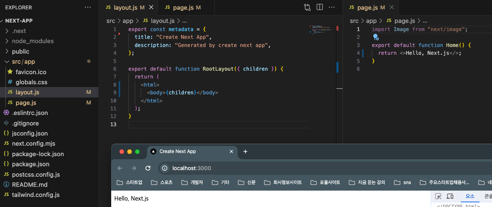

# nextjs
[강의 영상](https://www.youtube.com/watch?v=9KOaR6QMb9A&list=PLuHgQVnccGMCwxXsQuEoG-JJ7RlwtNdwJ&index=1) 0 ~ 5강

* `Next.js` 는 리액트를 기반의 풀스택 웹애플리케이션 프레임워크

# 간단 정리

* SSR 제공한다. 완성된 HTML 을 전송하기 때문에 자바스크립트를 실행할 수 없는 환경에서도 작동한다.

* nextjs 13 이후 버전은 `APP routher` 를 사용한다.

* `layout.js` 가 골자를 만든다.

* `page.js` 의 `return` 내용을 `layout.js` 의 `{children}` 에 가져온다.

    

* `layout.js` 에서 공통적인 것들을 다루면 좋다

* `npm run dev`

    

* `npm run build` 후 `npm run start`

    

* `metadata` 부분을 수정해서 브라우저의 탭 이름을 바꿀 수 있다.

* 기본적으로 서버에서 랜더링하고 브라우저로 전송한다. `console.log` 를 입력하면, 브라우저 콘솔이 아니라 서버에 입력된다.

    이때 `use client;` 를 파일의 맨 위에 선언하면, 서버에서 랜더링하고 브라우저에서도 랜더링하며 2번 랜더링한다.

