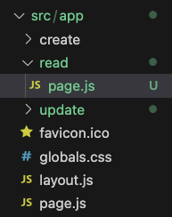
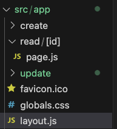

# nextjs
[강의 영상](https://www.youtube.com/watch?v=9KOaR6QMb9A&list=PLuHgQVnccGMCwxXsQuEoG-JJ7RlwtNdwJ&index=1) 6강

* `Next.js` 는 리액트를 기반의 풀스택 웹애플리케이션 프레임워크

# 간단 정리

* url 에 접근하려면, 해당 이름으로 된 디렉토리와 `page.js` 파일이 필요하다.

    예를 들어, `http://localhost:3000/read` 에 접근하려면 read 디렉토리가 필요하다.

    

* 그렇다면 `http://localhost:3000/read/1` 처럼 뒤에 추가 정보가 있을 경우엔 이렇게 한다.

    read 디렉토리에 `[id]` 디렉토리를 만들고 `page.js` 를 추가한다.

    

* next.js 는 SSR 이라는 장점이 있다.