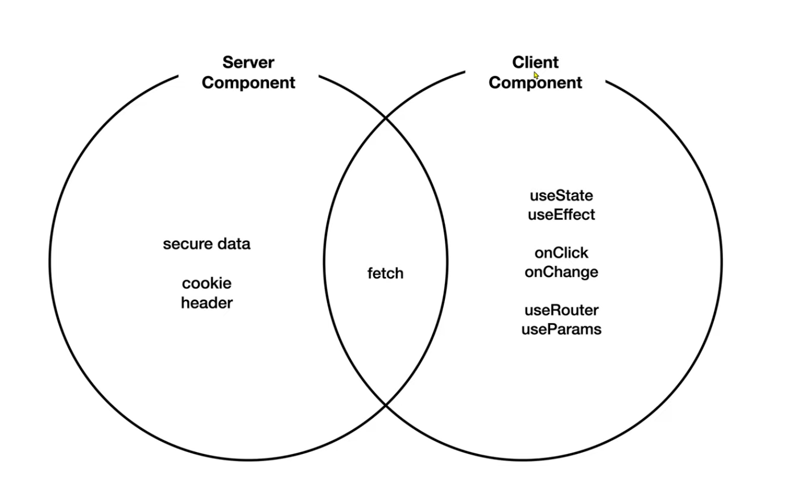

# nextjs
[강의 영상](https://www.youtube.com/watch?v=9KOaR6QMb9A&list=PLuHgQVnccGMCwxXsQuEoG-JJ7RlwtNdwJ&index=1) 6강 - 10강

* `Next.js` 는 리액트를 기반의 풀스택 웹애플리케이션 프레임워크

# 간단 정리

* `a` 태그는 클릭이나 새로고침을 할 때마다 서버와 통신하며 다시 로딩한다. 하지만 `Link` 로 바꾸면 한번 로딩한 후 새로고침을 하면 서버와 통신조차 하지 않느다. 이것이 SPA 라고 한다. 즉, `a` 태그를 `Link` 로 바꾸기만 해도 SPA 를 사용할 수 있다.

* 이미지는 public 폴더 안에 넣고, 이미지 주소는 `public 을 root` 로 생각하고 입력하면 된다.

* next 의 서버와 데이터베이스 활용하기

    * `npx json-server --port 9999 --watch db.json` 을 입력하면, root 에 `db.json` 을 참고하며, 서버를 실행한다.

* 데이터베이스에 데이터 추가하기 및 서버에서 데이터 fetch 하기

    * 데이터는 다음과 같은 형태로 추가한다.

        ```js
        {
            "topics": [
                {
                "id": 1,
                "title": "html",
                "body": "html is ..."
                },
                {
                "id": 1,
                "title": "css",
                "body": "css is ..."
                }
            ],
            ...
        }
        ```
    
    * topics 에 다음과 같은 방법으로 데이터에 접근할 수 있다.

        `fetch('http://localhost:9999/topics').then((res) => { return res.json();} ).then(res => {console.log('ret : ', res)});`

* server component 는 react18부터 생겼다. next 는 이것을 활용하는 것이다.

    * 사용자와 상호작용한다면 client component, 단순히 정보를 보여주는 것이라면 server component 로 구현하는 것이 좋다.

        
    
* SSR 의 특징

    * 자바스크립트 코드를 서버에서 처리하고 클라이언트로 전송하기 때문에 용량이 적다.

    * api 서버가 같다면 굉장히 빠르다.

    * 서버에서 동적으로 생성한 정적인 내용을 클라이언트로 전송하기 때문에, 브라우저에서 자바스크립트 동작을 중단해도 문제없이 동작한다.